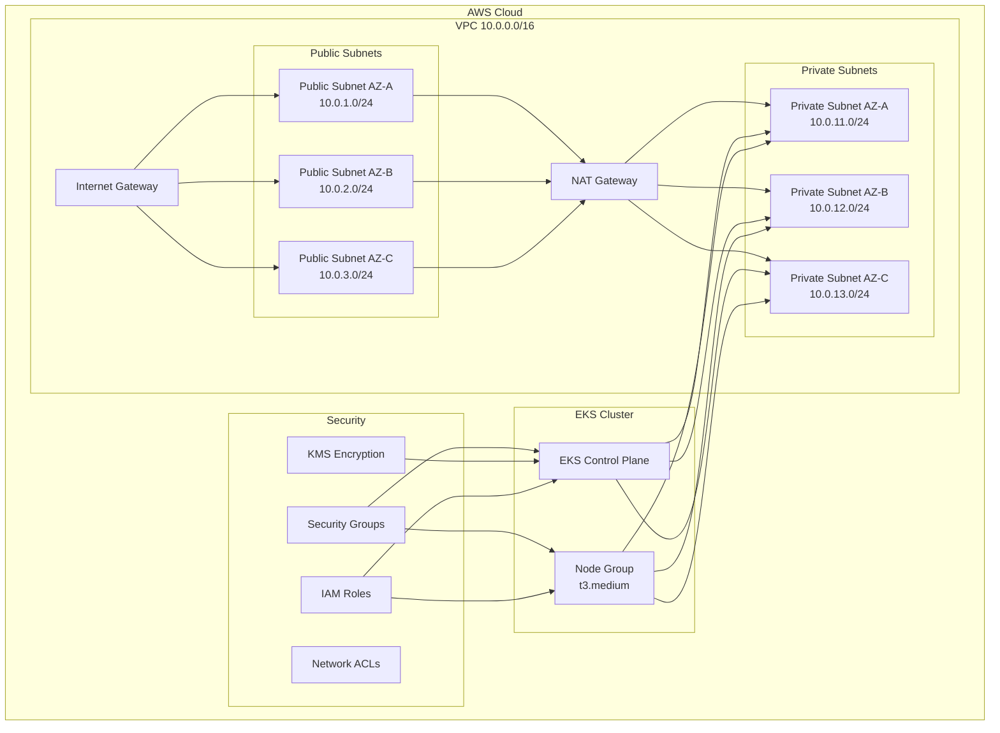

# AWS EKS Infrastructure - Production Ready

This repository contains Terraform code to deploy a production-ready, secure, and cost-optimized AWS EKS infrastructure.

## Architecture Overview



## Features

### Security Best Practices
- ✅ Private EKS endpoints with limited public access
- ✅ Encryption at rest using KMS for EKS secrets
- ✅ Encryption in transit (TLS)
- ✅ Network segmentation with public/private subnets
- ✅ Security groups with least privilege
- ✅ Network ACLs for defense in depth
- ✅ IAM roles with IRSA (IAM Roles for Service Accounts)
- ✅ Pod Security Standards enforced
- ✅ VPC Flow Logs enabled
- ✅ AWS GuardDuty integration ready
- ✅ Secrets encryption in etcd

### Cost Optimization
- ✅ Single NAT Gateway (can scale to multi-AZ if needed)
- ✅ t3.medium instances with burstable performance
- ✅ Spot instances support (optional)
- ✅ Cluster Autoscaler for dynamic scaling
- ✅ S3 backend with versioning for state management
- ✅ Resource tagging for cost allocation

### High Availability & Scalability
- ✅ Multi-AZ deployment (3 availability zones)
- ✅ Auto Scaling Groups
- ✅ EKS managed node groups
- ✅ Health checks and monitoring
- ✅ Load balancer ready

## Prerequisites

- AWS CLI configured with appropriate credentials
- Terraform >= 1.5.0
- kubectl >= 1.28
- helm >= 3.0

## Quick Start

### 1. Clone and Configure

```bash
cd aws-eks-infrastructure/terraform
cp terraform.tfvars.example terraform.tfvars
# Edit terraform.tfvars with your settings
```

### 2. Initialize Terraform

```bash
terraform init
```

### 3. Plan Deployment

```bash
terraform plan
```

### 4. Deploy Infrastructure

```bash
terraform apply
```

### 5. Configure kubectl

```bash
aws eks update-kubeconfig --region <your-region> --name <cluster-name>
```

## Cost Estimation

**Monthly Cost (us-east-1):**
- EKS Cluster: $73
- EC2 Instances (2x t3.medium): ~$60
- NAT Gateway: ~$32
- Data Transfer: ~$10-20
- EBS Storage: ~$10

**Total: ~$185-195/month**

## Security Hardening

### Network Security
- Private subnets for worker nodes
- Public subnets only for load balancers
- Restricted security group rules
- Network ACLs for additional protection

### Access Control
- RBAC enabled by default
- AWS IAM Authenticator
- IRSA for pod-level permissions
- No direct SSH access to nodes

### Data Protection
- KMS encryption for EKS secrets
- Encrypted EBS volumes
- Encrypted S3 backend
- VPC Flow Logs to CloudWatch

## Monitoring & Logging

- CloudWatch Container Insights (optional)
- VPC Flow Logs
- EKS Control Plane Logs
- Application Load Balancer logs

## Scaling

### Horizontal Pod Autoscaling
```bash
kubectl apply -f docs/examples/hpa-example.yaml
```

### Cluster Autoscaling
Cluster Autoscaler is deployed by default and will scale nodes between min/max defined in tfvars.

## Backup & Disaster Recovery

- Terraform state in S3 with versioning
- Daily automated snapshots of EBS volumes
- Multi-AZ deployment for high availability

## Maintenance

### Updating Kubernetes Version
```bash
# Update in terraform.tfvars
cluster_version = "1.28"
terraform apply
```

### Updating Node Groups
```bash
terraform taint module.eks.module.eks_managed_node_group
terraform apply
```

## Clean Up

```bash
terraform destroy
```

## Directory Structure

```
.
├── terraform/
│   ├── main.tf                 # Main infrastructure
│   ├── vpc.tf                  # VPC configuration
│   ├── eks.tf                  # EKS cluster
│   ├── security.tf             # Security groups & NACLs
│   ├── iam.tf                  # IAM roles & policies
│   ├── variables.tf            # Input variables
│   ├── outputs.tf              # Output values
│   ├── versions.tf             # Provider versions
│   └── terraform.tfvars.example
├── scripts/
│   ├── setup.sh                # Initial setup script
│   └── cleanup.sh              # Cleanup script
├── docs/
│   └── examples/               # Example manifests
└── README.md
```

## Troubleshooting

### Issue: Can't connect to cluster
```bash
aws eks update-kubeconfig --region <region> --name <cluster-name>
```

### Issue: Nodes not joining cluster
Check security groups and ensure VPC has DNS hostnames enabled.

### Issue: High costs
- Consider using Spot instances
- Reduce node count during off-hours
- Use Cluster Autoscaler aggressively

## Contributing

1. Fork the repository
2. Create a feature branch
3. Commit your changes
4. Push to the branch
5. Create a Pull Request

## License

MIT License

## Support

For issues and questions, please open a GitHub issue.
